# Expense Tracker App

 

----------

### Link to webapp: [Click here](https://expense-tracker-kbh.onrender.com/)

----------

<!-- Description -->
## Description

This is just an app which tracks your expenses, which you need to manually enter. You can create, edit and delete expenses. It shows you a log of your recent expenses, monthly repeating expenses, and also daily, monthly and total expenditure.

It is built using React.js for the frontend, Node.js and Express.js as the backend, and MongoDB as the database. 
The backend is a RESTful api which is deployed on another server, and the React app makes fetch requests to the server to retrieve information and display.

----------

## Screenshots

1. Home page when logged out 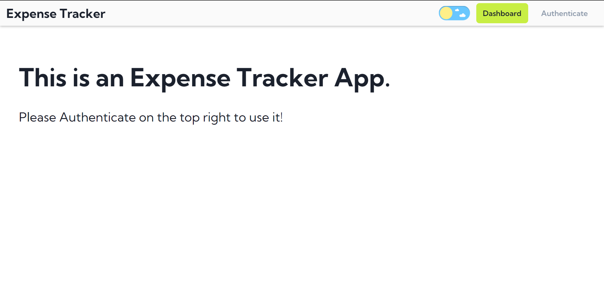
    Dark mode 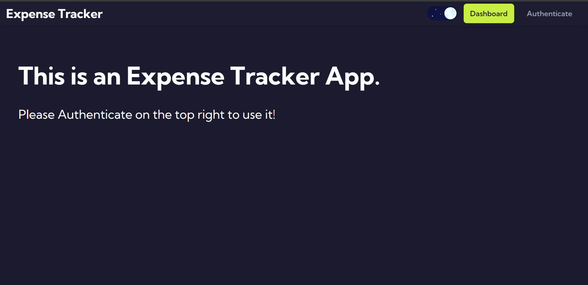
2. Registration page 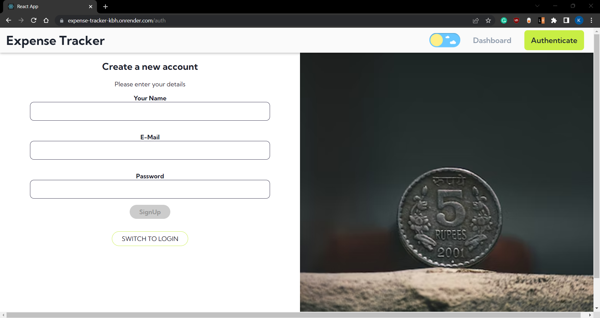
3. Login page 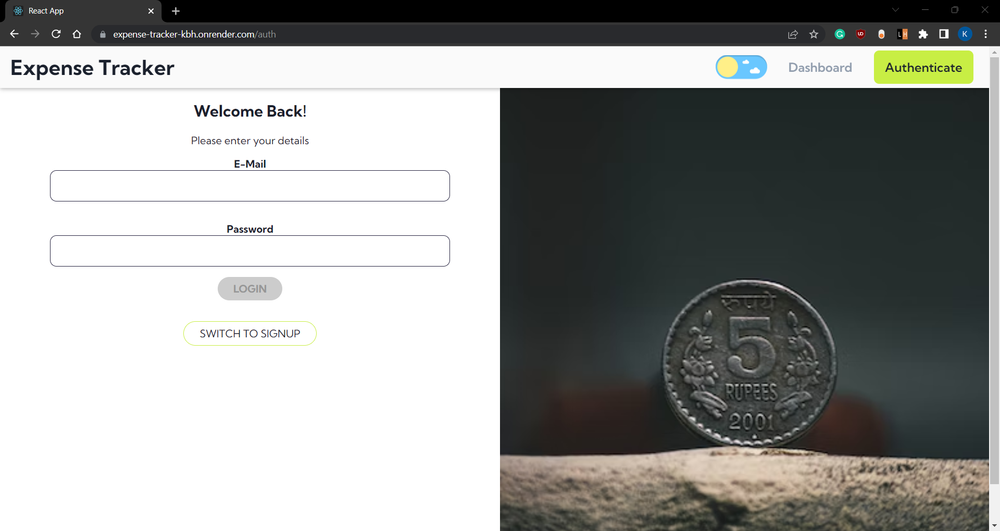
4. First signup page dashboard 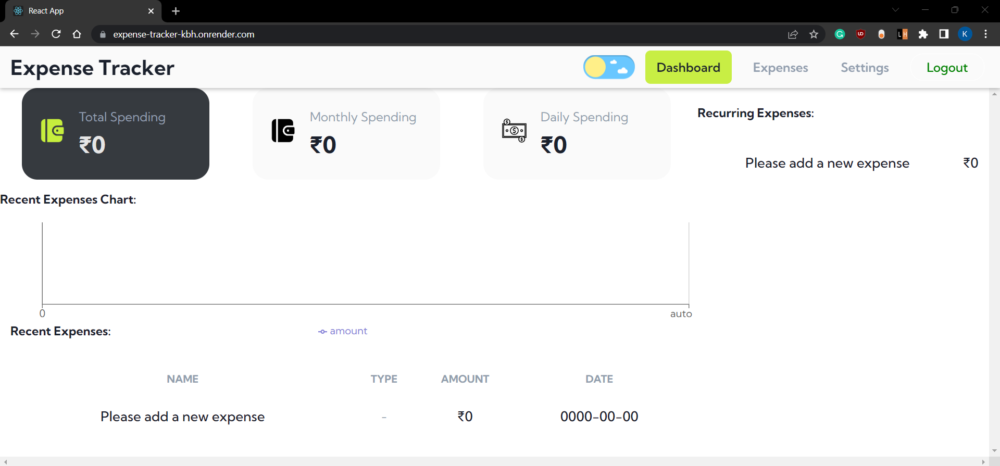
5. Filled dashboard 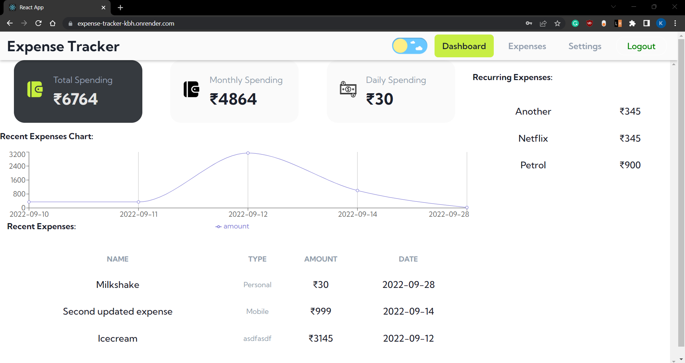
    Dark mode 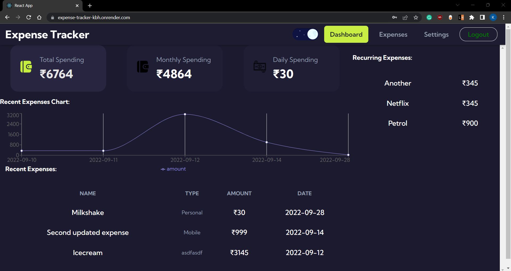
6. Expenses page 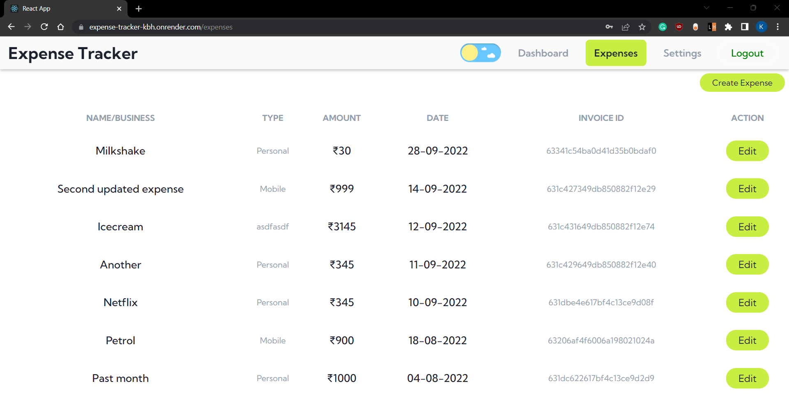
7. Create new expense 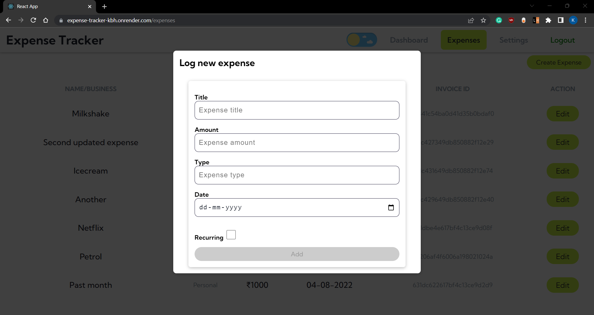
8. Edit expense 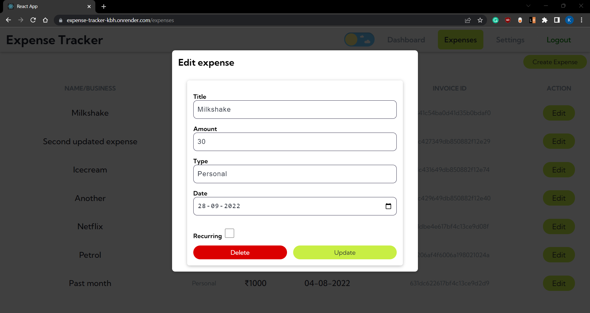
9. Delete expense warning 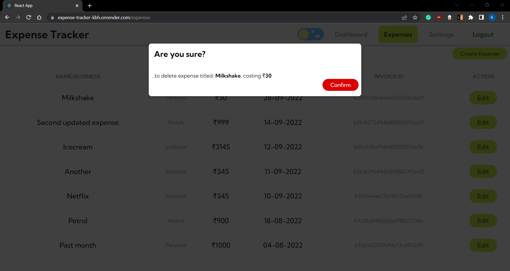
10. Settings Page 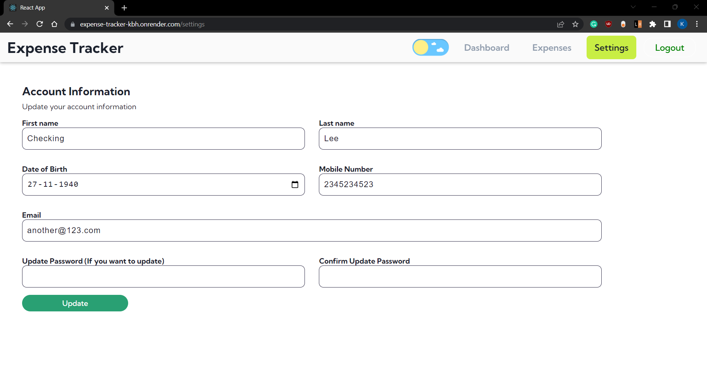
11. Mobile Responsive view 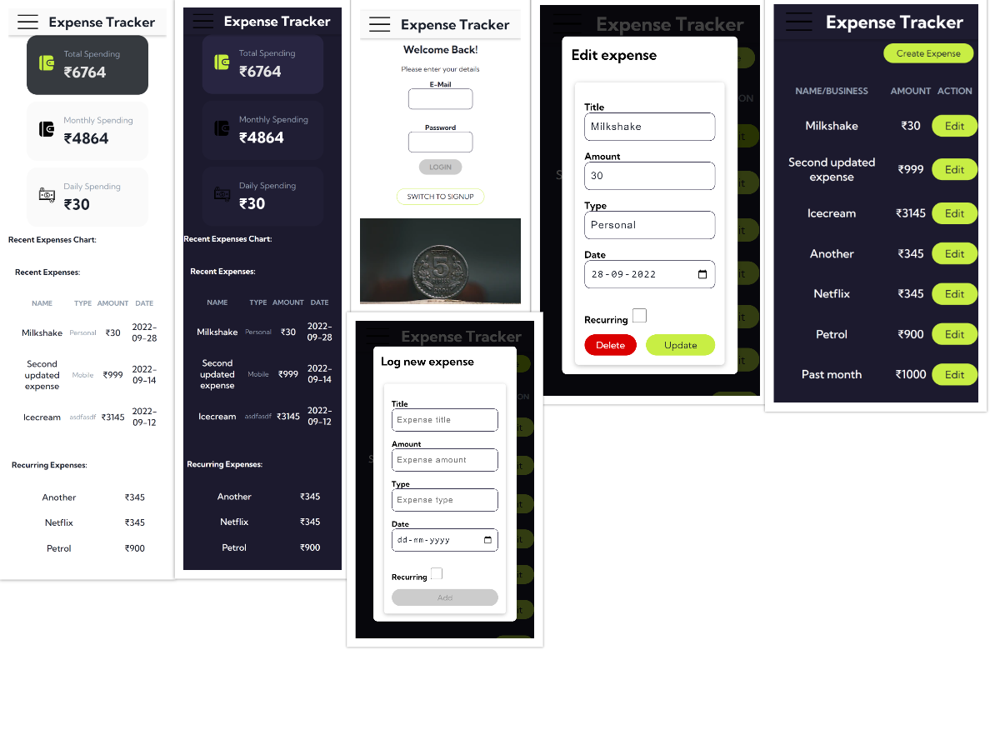

----------

<!-- file structure -->
## File Structure

This section explains the file structure for the whole project.

### frontend

The frontend file contains the entirety of the frontend application. This means the ReactJS code with different sections designed, like:

- `public` directory contains information for the basic React application.
- `src` contains the pages, components, and the assets used for the pages.
    - `index.js` simply imports the `App` component from `App.js` with `React.StrictMode`
    - `App.js` contains the routing for the individual pages. Here, there is logic on how to deal with logged in and logged out user state, and specifies the routes that will be visited when a specific URL is hit.
    - `user` folder contains everything related to the user's logging in and/or signing up.
    - `shared` folder contains all the components, context, hooks and utilities which is used in common between all pages. E.g. The Navigation bar/sidebar is common to all the pages, and so is inside the shared components.
    - `settings` folder contains everything related to the "Settings" page, divided into the actual page folder and components of the same page folder.
    - `expenses` folder contains everything related to the "Expenses" page of the app, divided similarly into components and pages folder.
    - `dashboard` folder similarly contains everything related to the "Dashboard" page, or the home page when you are logged in.
- `package.json` contains the respective dependencies
- `package-lock.json` lock file for package.json
- `.env.example` is a sample file created to show how the actual .env file (which is not uploaded) looks.
- `README.md` basic documentation generated by ReactJS

<!-- backend -->
### Backend

Contains the entirety of the backend code, written in ExpressJS. The explanations for the subdirectory are as follows,

- `server.js` is sort of the starting file which starts running everything. It connects the backend to the cloud mongo database, and starts the backend on a server.
- `app.js` handles and directs the routes to the respective files for routing, and handles other functions like the error handling and CORS middleware
- `DUMMY_DATA.js` was just initially created to have a rough idea of how every element in the backend would look like.
- `routes` folder contains all the expense and user routes, just directing stuff to the required path according to the MVC architecture.
- `models` contains the type of individual model elements to be created in the database should adhere to. It also contains the custom error handler created.
- `middleware` folder contains the file to check the incoming request token's authentication using the jsonwebtoken.
- `controllers` folder contains all the controller functions of the users and expenses where the actual login of getting and sending information based on the type of incoming request comes into play.
- `config.env.example` is a sample file created to show how the actual config.env file (which is not uploaded) looks.
- `package.json` contains the respective dependencies
- `package-lock.json` lock file for package.json

----------

<!-- GETTING STARTED -->
## Getting Started

This is dedicated to setting the software up

<!-- INSTALLATION -->
### Installation

Frontend:

`cd` into the 'frontend' folder and execute `npm i` on the terminal to install all the dependencies.

Then, execute `npm start` to open the project in browser @localhost:3000.

Backend:

`cd` into the 'backend' folder and execute `npm i` on the terminal to install all the dependencies.

Execute `nodemon server.js` to start the server on the port specified in the config.env file(which you can change for local use).

----------

<!-- contributing -->
## Contributing

Contributions are what make the open source community such an amazing place to be learn, inspire, and create. Any contributions you make are **greatly appreciated**.

1. Fork the Project
2. Create your Feature Branch (`git checkout -b feature/AmazingFeature`)
3. Commit your Changes (`git commit -m 'Add some AmazingFeature'`)
4. Push to the Branch (`git push origin feature/AmazingFeature`)
5. Open a Pull Request

----------

# Todo

- Improve this README
- Plan out how to structure the documentation